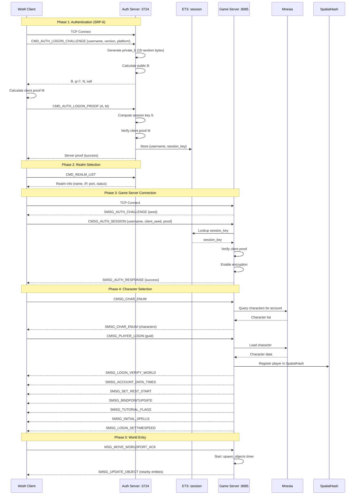
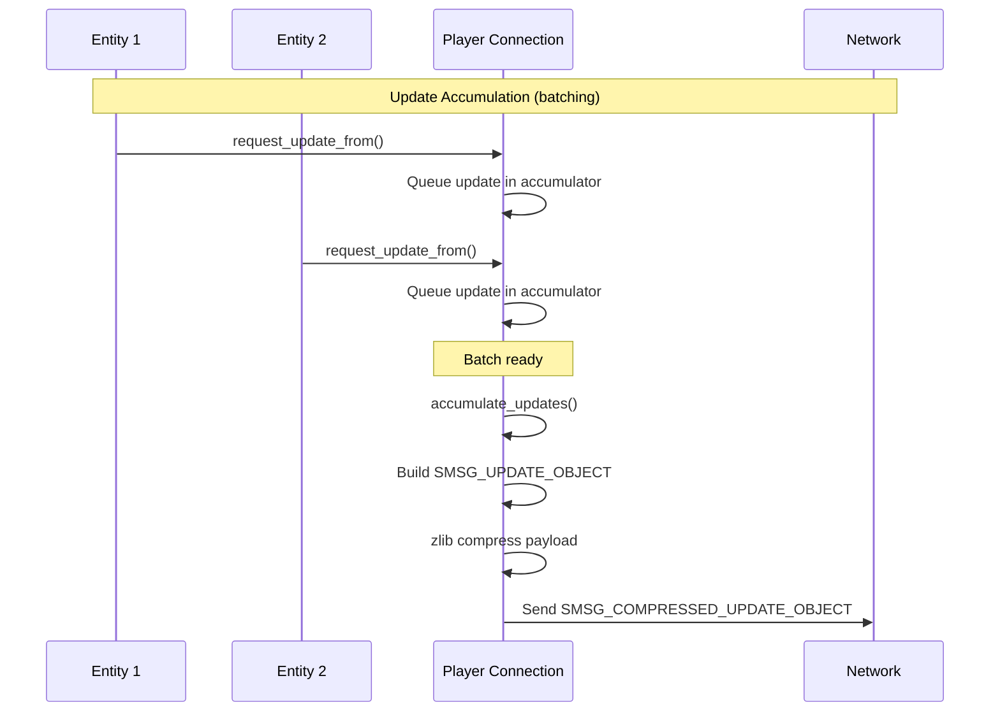

# Thistle Tea Architecture Overview

This document provides a comprehensive architectural overview of Thistle Tea, a World of Warcraft 1.12.1 (vanilla) private server emulator written in Elixir.

## Table of Contents

1. [System Overview](#system-overview)
2. [High-Level Architecture](#high-level-architecture)
3. [Network Layer](#network-layer)
4. [Entity System](#entity-system)
5. [World Systems](#world-systems)
6. [Database Layer](#database-layer)
7. [Authentication Flow](#authentication-flow)
8. [Game Loop & Tick System](#game-loop--tick-system)
9. [OTP Process Architecture](#otp-process-architecture)
10. [Web Interface](#web-interface)
11. [Caveats](#caveats)

---

## System Overview

Thistle Tea implements a functional WoW vanilla server handling:
- Player authentication via SRP-6
- Character creation and management
- World simulation with mob spawning/respawning
- Combat mechanics (spells, auto-attacks)
- Player-to-player interaction (chat, visibility)
- Navigation AI for mobs using pathfinding

### Technology Stack

| Component | Technology |
|-----------|------------|
| Language | Elixir |
| Web Framework | Phoenix (LiveView, LiveDashboard) |
| Native Extensions | Rust (via Rustler for pathfinding) |
| Database | SQLite (world data), Mnesia (accounts/characters) |
| TCP Server | ThousandIsland |
| Asset Pipeline | Tailwind CSS, esbuild |

---

## High-Level Architecture

```
┌─────────────────────────────────────────────────────────────────────────────┐
│                              WoW 1.12.1 Client                              │
└─────────────────────────────────────────────────────────────────────────────┘
                    │                                    │
                    │ TCP :3724                          │ TCP :8085
                    ▼                                    ▼
┌─────────────────────────────┐        ┌─────────────────────────────────────┐
│       Auth Server           │        │           Game Server               │
│   (ThousandIsland TCP)      │        │      (ThousandIsland TCP)           │
│                             │        │                                     │
│  ┌───────────────────────┐  │        │  ┌─────────────────────────────┐    │
│  │   SRP-6 Challenge     │  │        │  │    Connection Handler       │    │
│  │   SRP-6 Proof         │──┼────────┼─▶│    Packet Encryption        │    │
│  │   Realm List          │  │session │  │    Message Dispatch         │    │
│  └───────────────────────┘  │  key   │  └─────────────────────────────┘    │
└─────────────────────────────┘        └─────────────────────────────────────┘
                                                        │
                    ┌───────────────────────────────────┼───────────────────┐
                    │                                   │                   │
                    ▼                                   ▼                   ▼
        ┌───────────────────┐             ┌───────────────────┐   ┌─────────────────┐
        │   Entity System   │             │   World Systems   │   │  Database Layer │
        │                   │             │                   │   │                 │
        │  - Player         │◀───────────▶│  - SpatialHash    │   │  - Mangos (SQL) │
        │  - Mob            │             │  - CellActivator  │   │  - DBC (SQL)    │
        │  - GameObject     │             │  - GameEvent      │   │  - Mnesia       │
        │  - Components     │             │  - Movement       │   │                 │
        └───────────────────┘             └───────────────────┘   └─────────────────┘
                    │                                   │
                    └───────────────────┬───────────────┘
                                        ▼
                            ┌───────────────────────┐
                            │    Phoenix PubSub     │
                            │    (Event Bus)        │
                            └───────────────────────┘
                                        │
                                        ▼
                            ┌───────────────────────┐
                            │    Web Interface      │
                            │    (Phoenix/LiveView) │
                            │    Port :4000         │
                            └───────────────────────┘
```

---

## Network Layer

### Server Architecture

```
┌─────────────────────────────────────────────────────────────────────────────┐
│                         ThousandIsland TCP Server                           │
├─────────────────────────────────────────────────────────────────────────────┤
│                                                                             │
│   ┌─────────────────┐      ┌─────────────────┐      ┌─────────────────┐    │
│   │   Acceptor      │      │   Acceptor      │      │   Acceptor      │    │
│   │   Pool          │      │   Pool          │      │   Pool          │    │
│   └────────┬────────┘      └────────┬────────┘      └────────┬────────┘    │
│            │                        │                        │              │
│            ▼                        ▼                        ▼              │
│   ┌─────────────────┐      ┌─────────────────┐      ┌─────────────────┐    │
│   │  Connection 1   │      │  Connection 2   │      │  Connection N   │    │
│   │  (GenServer)    │      │  (GenServer)    │      │  (GenServer)    │    │
│   │                 │      │                 │      │                 │    │
│   │  ┌───────────┐  │      │  ┌───────────┐  │      │  ┌───────────┐  │    │
│   │  │  State    │  │      │  │  State    │  │      │  │  State    │  │    │
│   │  │           │  │      │  │           │  │      │  │           │  │    │
│   │  │ - session │  │      │  │ - session │  │      │  │ - session │  │    │
│   │  │ - crypto  │  │      │  │ - crypto  │  │      │  │ - crypto  │  │    │
│   │  │ - queue   │  │      │  │ - queue   │  │      │  │ - queue   │  │    │
│   │  │ - entity  │  │      │  │ - entity  │  │      │  │ - entity  │  │    │
│   │  └───────────┘  │      │  └───────────┘  │      │  └───────────┘  │    │
│   └─────────────────┘      └─────────────────┘      └─────────────────┘    │
│                                                                             │
└─────────────────────────────────────────────────────────────────────────────┘
```

### Packet Structure

```
┌──────────────────────────────────────────────────────────────┐
│                      WoW Packet Format                        │
├──────────────────────────────────────────────────────────────┤
│                                                              │
│   ┌─────────────────────────┬─────────────────────────────┐  │
│   │   Encrypted Header      │   Unencrypted Payload       │  │
│   │   (6 bytes)             │   (variable)                │  │
│   ├─────────────────────────┼─────────────────────────────┤  │
│   │                         │                             │  │
│   │  ┌─────────┬─────────┐  │  ┌───────────────────────┐  │  │
│   │  │  Size   │ Opcode  │  │  │   Message Data        │  │  │
│   │  │ 2 bytes │ 4 bytes │  │  │   (opcode-specific)   │  │  │
│   │  │ (big)   │ (little)│  │  │                       │  │  │
│   │  └─────────┴─────────┘  │  └───────────────────────┘  │  │
│   │                         │                             │  │
│   └─────────────────────────┴─────────────────────────────┘  │
│                                                              │
└──────────────────────────────────────────────────────────────┘
```

### Encryption Flow (RC4-Style Stream Cipher)

```
                    Session Key (40 bytes from SRP-6)
                              │
                              ▼
              ┌───────────────────────────────┐
              │      Crypto State             │
              │                               │
              │   send_i, send_j (encrypt)    │
              │   recv_i, recv_j (decrypt)    │
              └───────────────────────────────┘
                     │                │
                     ▼                ▼
              ┌─────────────┐  ┌─────────────┐
              │  Encrypt    │  │  Decrypt    │
              │  Header     │  │  Header     │
              │  (outgoing) │  │  (incoming) │
              └─────────────┘  └─────────────┘
```

### Packet Processing Pipeline

```
┌───────────┐    ┌───────────┐    ┌───────────┐    ┌───────────┐
│   Raw     │    │  Decrypt  │    │  Parse    │    │  Dispatch │
│   TCP     │───▶│  Header   │───▶│  Opcode   │───▶│  Handler  │
│   Data    │    │           │    │  + Data   │    │           │
└───────────┘    └───────────┘    └───────────┘    └───────────┘
                                                          │
                                                          ▼
┌───────────┐    ┌───────────┐    ┌───────────┐    ┌───────────┐
│   Send    │    │  Encrypt  │    │  Build    │    │  Handle   │
│   TCP     │◀───│  Header   │◀───│  Response │◀───│  Message  │
│           │    │           │    │           │    │           │
└───────────┘    └───────────┘    └───────────┘    └───────────┘
```

---

## Entity System

### Component Architecture

```
┌─────────────────────────────────────────────────────────────────────────────┐
│                           Entity Structure                                  │
├─────────────────────────────────────────────────────────────────────────────┤
│                                                                             │
│   ┌─────────────────────────────────────────────────────────────────────┐   │
│   │                         Entity                                      │   │
│   ├─────────────────────────────────────────────────────────────────────┤   │
│   │                                                                     │   │
│   │   ┌───────────────┐  ┌───────────────┐  ┌───────────────────────┐   │   │
│   │   │    Object     │  │     Unit      │  │       Player          │   │   │
│   │   │  (base)       │  │               │  │   (players only)      │   │   │
│   │   │               │  │               │  │                       │   │   │
│   │   │  - guid       │  │  - health     │  │  - inventory          │   │   │
│   │   │  - type       │  │  - powers     │  │  - equipment          │   │   │
│   │   │  - entry      │  │  - level      │  │  - skills             │   │   │
│   │   │  - scale      │  │  - faction    │  │  - stats              │   │   │
│   │   │               │  │  - flags      │  │  - honor              │   │   │
│   │   │               │  │  - speeds     │  │  - bank               │   │   │
│   │   └───────────────┘  └───────────────┘  └───────────────────────┘   │   │
│   │                                                                     │   │
│   │   ┌───────────────────────────┐  ┌───────────────────────────────┐  │   │
│   │   │     MovementBlock         │  │        Internal               │  │   │
│   │   │                           │  │    (server-side only)         │  │   │
│   │   │  - position (x, y, z)     │  │                               │  │   │
│   │   │  - orientation            │  │  - map                        │  │   │
│   │   │  - movement_flags         │  │  - name                       │  │   │
│   │   │  - speeds (walk/run/etc)  │  │  - area                       │  │   │
│   │   │  - spline_data            │  │  - spells                     │  │   │
│   │   │                           │  │  - spawn_distance             │  │   │
│   │   │                           │  │  - waypoint_route             │  │   │
│   │   └───────────────────────────┘  └───────────────────────────────┘  │   │
│   │                                                                     │   │
│   └─────────────────────────────────────────────────────────────────────┘   │
│                                                                             │
└─────────────────────────────────────────────────────────────────────────────┘
```

### Entity Type Hierarchy

```
                              ┌──────────────┐
                              │    Entity    │
                              │   (base)     │
                              └──────┬───────┘
                                     │
              ┌──────────────────────┼──────────────────────┐
              │                      │                      │
              ▼                      ▼                      ▼
      ┌──────────────┐      ┌──────────────┐      ┌──────────────┐
      │    Player    │      │     Mob      │      │  GameObject  │
      │              │      │              │      │              │
      │  Components: │      │  Components: │      │  Components: │
      │  - Object    │      │  - Object    │      │  - Object    │
      │  - Unit      │      │  - Unit      │      │              │
      │  - Player    │      │              │      │              │
      │  - Movement  │      │  - Movement  │      │              │
      │  - Internal  │      │  - Internal  │      │  - Internal  │
      └──────────────┘      └──────────────┘      └──────────────┘
```

### AI Behavior Tree System

```
┌─────────────────────────────────────────────────────────────────────────────┐
│                        Behavior Tree Architecture                           │
├─────────────────────────────────────────────────────────────────────────────┤
│                                                                             │
│   ┌─────────────────────────────────────────────────────────────────────┐   │
│   │                         BT Node Types                               │   │
│   │                                                                     │   │
│   │   Selector (OR)         Sequence (AND)        Leaf Nodes            │   │
│   │   ┌─────────┐           ┌─────────┐           ┌─────────────────┐   │   │
│   │   │    ?    │           │   ──▶   │           │   Condition     │   │   │
│   │   │  first  │           │   all   │           │   (predicate)   │   │   │
│   │   │ success │           │  must   │           ├─────────────────┤   │   │
│   │   │  wins   │           │ succeed │           │   Action        │   │   │
│   │   └─────────┘           └─────────┘           │   (side effect) │   │   │
│   │                                               └─────────────────┘   │   │
│   └─────────────────────────────────────────────────────────────────────┘   │
│                                                                             │
│   ┌─────────────────────────────────────────────────────────────────────┐   │
│   │                      Mob Behavior Tree                              │   │
│   │                                                                     │   │
│   │   Selector                                                          │   │
│   │   ├── Sequence: Tethering                                           │   │
│   │   │   ├── Condition: tethering_to_spawn?                            │   │
│   │   │   └── Action: wait_for_arrival                                  │   │
│   │   │                                                                 │   │
│   │   ├── Sequence: Dead                                                │   │
│   │   │   ├── Condition: dead?                                          │   │
│   │   │   └── Action: idle_dead                                         │   │
│   │   │                                                                 │   │
│   │   ├── Sequence: Combat                                              │   │
│   │   │   ├── Condition: in_combat?                                     │   │
│   │   │   ├── Action: set_running_true                                  │   │
│   │   │   └── Selector (chase/tether/idle)                              │   │
│   │   │       ├── Sequence: should_tether → move_to_spawn               │   │
│   │   │       ├── Sequence: in_range → combat_wait                      │   │
│   │   │       ├── Sequence: chase_ready → chase_repath                  │   │
│   │   │       └── Action: wait_for_chase_tick                           │   │
│   │   │                                                                 │   │
│   │   ├── Sequence: Waypoints                                           │   │
│   │   │   ├── Condition: has_waypoints?                                 │   │
│   │   │   ├── Action: wait_until_waypoint_ready                         │   │
│   │   │   ├── Action: pick_waypoint                                     │   │
│   │   │   ├── Action: move_to_target                                    │   │
│   │   │   ├── Action: wait_for_arrival                                  │   │
│   │   │   └── Action: apply_waypoint + set_next_wait                    │   │
│   │   │                                                                 │   │
│   │   ├── Sequence: Wander                                              │   │
│   │   │   ├── Condition: can_wander?                                    │   │
│   │   │   ├── Action: wait_until_wander_ready                           │   │
│   │   │   ├── Action: pick_wander_point                                 │   │
│   │   │   ├── Action: move_to_target                                    │   │
│   │   │   ├── Action: wait_for_arrival                                  │   │
│   │   │   └── Action: set_next_wander_wait                              │   │
│   │   │                                                                 │   │
│   │   └── Action: idle                                                  │   │
│   └─────────────────────────────────────────────────────────────────────┘   │
│                                                                             │
│   ┌─────────────────────────────────────────────────────────────────────┐   │
│   │                        Blackboard (AI State)                        │   │
│   │                                                                     │   │
│   │   Per-entity mutable state for behavior tree execution:             │   │
│   │                                                                     │   │
│   │   ┌─────────────────────────────────────────────────────────────┐   │   │
│   │   │  target           - Current movement target {x, y, z}       │   │   │
│   │   │  move_target      - Active move destination                 │   │   │
│   │   │  orientation      - Facing direction at waypoint            │   │   │
│   │   │  wait_time        - Waypoint pause duration                 │   │   │
│   │   │  last_target_pos  - Last known chase target position        │   │   │
│   │   │  chase_started    - Whether chase is active                 │   │   │
│   │   │  next_chase_at    - Timestamp for next chase tick           │   │   │
│   │   │  next_wander_at   - Timestamp for next wander attempt       │   │   │
│   │   │  next_waypoint_at - Timestamp for next waypoint move        │   │   │
│   │   └─────────────────────────────────────────────────────────────┘   │   │
│   │                                                                     │   │
│   │   Timing uses Game.Time (monotonic milliseconds) for scheduling     │   │
│   └─────────────────────────────────────────────────────────────────────┘   │
│                                                                             │
│   ┌─────────────────────────────────────────────────────────────────────┐   │
│   │                      Tick Return Values                             │   │
│   │                                                                     │   │
│   │   :success  - Node completed successfully, continue                 │   │
│   │   :failure  - Node failed, try next sibling (selector)              │   │
│   │   :running  - Node in progress, re-tick next frame                  │   │
│   │   {:running, delay_ms} - Reschedule tick after delay                │   │
│   └─────────────────────────────────────────────────────────────────────┘   │
│                                                                             │
└─────────────────────────────────────────────────────────────────────────────┘
```

### Update Mask System

```
┌─────────────────────────────────────────────────────────────────────────────┐
│                         Update Mask Flow                                    │
├─────────────────────────────────────────────────────────────────────────────┤
│                                                                             │
│   ┌───────────────────────────────────────────────────────────────────┐     │
│   │  Component Fields with Metadata                                   │     │
│   │                                                                   │     │
│   │  defcomponent Object do                                           │     │
│   │    field :guid,    {0, 2, :guid}      # offset=0, size=2 units   │     │
│   │    field :type,    {2, 1, :int32}     # offset=2, size=1 unit    │     │
│   │    field :entry,   {3, 1, :int32}     # offset=3, size=1 unit    │     │
│   │    field :scale_x, {4, 1, :float}     # offset=4, size=1 unit    │     │
│   │  end                                                              │     │
│   └───────────────────────────────────────────────────────────────────┘     │
│                              │                                              │
│                              ▼                                              │
│   ┌───────────────────────────────────────────────────────────────────┐     │
│   │  flatten_field_structs()                                          │     │
│   │                                                                   │     │
│   │  Collect all fields across components → sorted by offset          │     │
│   └───────────────────────────────────────────────────────────────────┘     │
│                              │                                              │
│              ┌───────────────┴───────────────┐                              │
│              ▼                               ▼                              │
│   ┌─────────────────────┐         ┌─────────────────────┐                   │
│   │  generate_mask()    │         │  generate_objects() │                   │
│   │                     │         │                     │                   │
│   │  Bitmask indicating │         │  Serialized field   │                   │
│   │  which fields are   │         │  values for changed │                   │
│   │  present/changed    │         │  fields only        │                   │
│   └─────────────────────┘         └─────────────────────┘                   │
│              │                               │                              │
│              └───────────────┬───────────────┘                              │
│                              ▼                                              │
│   ┌───────────────────────────────────────────────────────────────────┐     │
│   │  SMSG_UPDATE_OBJECT                                               │     │
│   │                                                                   │     │
│   │  [count | blocks...]                                              │     │
│   │  Each block: [type | packed_guid | movement | mask | objects]     │     │
│   └───────────────────────────────────────────────────────────────────┘     │
│                                                                             │
└─────────────────────────────────────────────────────────────────────────────┘
```

---

## World Systems

### Spatial Hash (Grid-Based Cell System)

```
┌─────────────────────────────────────────────────────────────────────────────┐
│                          World Grid Layout                                  │
├─────────────────────────────────────────────────────────────────────────────┤
│                                                                             │
│        Cell Size: 125 units                                                 │
│                                                                             │
│   ┌─────────┬─────────┬─────────┬─────────┬─────────┬─────────┐             │
│   │ (-2,-2) │ (-1,-2) │ (0,-2)  │ (1,-2)  │ (2,-2)  │ (3,-2)  │             │
│   ├─────────┼─────────┼─────────┼─────────┼─────────┼─────────┤             │
│   │ (-2,-1) │ (-1,-1) │ (0,-1)  │ (1,-1)  │ (2,-1)  │ (3,-1)  │             │
│   ├─────────┼─────────┼─────────┼─────────┼─────────┼─────────┤             │
│   │ (-2,0)  │ (-1,0)  │ (0,0)   │ (1,0)   │ (2,0)   │ (3,0)   │             │
│   │         │         │    P    │         │         │         │             │
│   ├─────────┼─────────┼─────────┼─────────┼─────────┼─────────┤             │
│   │ (-2,1)  │ (-1,1)  │ (0,1)   │ (1,1)   │ (2,1)   │ (3,1)   │             │
│   ├─────────┼─────────┼─────────┼─────────┼─────────┼─────────┤             │
│   │ (-2,2)  │ (-1,2)  │ (0,2)   │ (1,2)   │ (2,2)   │ (3,2)   │             │
│   └─────────┴─────────┴─────────┴─────────┴─────────┴─────────┘             │
│                                                                             │
│   P = Player position                                                       │
│   Hash: {map_id, div(x, 125), div(y, 125), div(z, 125)}                    │
│                                                                             │
└─────────────────────────────────────────────────────────────────────────────┘
```

### ETS Table Structure

```
┌─────────────────────────────────────────────────────────────────────────────┐
│                         ETS Tables for Spatial Data                         │
├─────────────────────────────────────────────────────────────────────────────┤
│                                                                             │
│   :players (duplicate_bag)           :mobs (duplicate_bag)                  │
│   ┌──────────────────────────┐       ┌──────────────────────────┐           │
│   │ {cell_hash, player_guid} │       │ {cell_hash, mob_guid}    │           │
│   │ {cell_hash, player_guid} │       │ {cell_hash, mob_guid}    │           │
│   │ ...                      │       │ ...                      │           │
│   └──────────────────────────┘       └──────────────────────────┘           │
│                                                                             │
│   :game_objects (duplicate_bag)      :entities (set)                        │
│   ┌──────────────────────────┐       ┌──────────────────────────────────┐   │
│   │ {cell_hash, obj_guid}    │       │ {guid, pid, map, x, y, z}        │   │
│   │ {cell_hash, obj_guid}    │       │ {guid, pid, map, x, y, z}        │   │
│   │ ...                      │       │ ...                              │   │
│   └──────────────────────────┘       └──────────────────────────────────┘   │
│                                                                             │
└─────────────────────────────────────────────────────────────────────────────┘
```

### Cell Activation System

```
┌─────────────────────────────────────────────────────────────────────────────┐
│                     Cell Activation Flow (1s interval)                      │
├─────────────────────────────────────────────────────────────────────────────┤
│                                                                             │
│   ┌───────────────┐                                                         │
│   │ CellActivator │                                                         │
│   │  (GenServer)  │                                                         │
│   └───────┬───────┘                                                         │
│           │                                                                 │
│           ▼                                                                 │
│   ┌───────────────────────────────────────────────────────────────────┐     │
│   │  1. Get all player cells from :players ETS                        │     │
│   └───────────────────────────────────────────────────────────────────┘     │
│           │                                                                 │
│           ▼                                                                 │
│   ┌───────────────────────────────────────────────────────────────────┐     │
│   │  2. Expand each cell by 2 in all directions                       │     │
│   │                                                                   │     │
│   │     Player Cell         Expanded View (±2 cells)                  │     │
│   │         ┌─┐             ┌─┬─┬─┬─┬─┐                               │     │
│   │         │P│    ──▶      ├─┼─┼─┼─┼─┤                               │     │
│   │         └─┘             ├─┼─┼P┼─┼─┤                               │     │
│   │                         ├─┼─┼─┼─┼─┤                               │     │
│   │                         └─┴─┴─┴─┴─┘                               │     │
│   └───────────────────────────────────────────────────────────────────┘     │
│           │                                                                 │
│           ▼                                                                 │
│   ┌───────────────────────────────────────────────────────────────────┐     │
│   │  3. Compare with previously active cells                          │     │
│   │                                                                   │     │
│   │     new_cells = current - previous                                │     │
│   │     old_cells = previous - current                                │     │
│   └───────────────────────────────────────────────────────────────────┘     │
│           │                                                                 │
│     ┌─────┴─────┐                                                           │
│     ▼           ▼                                                           │
│  ┌────────┐  ┌────────┐                                                     │
│  │ Spawn  │  │ Despawn│                                                     │
│  │ in new │  │ in old │                                                     │
│  │ cells  │  │ cells  │                                                     │
│  └────────┘  └────────┘                                                     │
│                                                                             │
└─────────────────────────────────────────────────────────────────────────────┘
```

### Entity Spawning Flow

```
               ┌─────────────────┐
               │  CellActivator  │
               └────────┬────────┘
                        │
                        ▼
               ┌─────────────────┐
               │  Loader.Mob     │
               │  or             │
               │  Loader.Object  │
               └────────┬────────┘
                        │
                        ▼
        ┌───────────────────────────────┐
        │      Query Mangos DB          │
        │                               │
        │  creature / game_object table │
        │  + creature_template          │
        │  + game_event_creature        │
        └───────────────┬───────────────┘
                        │
                        ▼
        ┌───────────────────────────────┐
        │   Filter by active events     │
        │   (GameEventSystem)           │
        └───────────────┬───────────────┘
                        │
                        ▼
        ┌───────────────────────────────┐
        │   DynamicSupervisor           │
        │   start_child()               │
        └───────────────┬───────────────┘
                        │
              ┌─────────┴─────────┐
              ▼                   ▼
     ┌────────────────┐  ┌────────────────┐
     │  Mob GenServer │  │ Object Server  │
     │                │  │                │
     │  - init state  │  │  - init state  │
     │  - register    │  │  - register    │
     │  - start AI    │  │                │
     └────────────────┘  └────────────────┘
```

---

## Database Layer

### Database Architecture

```
┌─────────────────────────────────────────────────────────────────────────────┐
│                          Database Layer                                      │
├─────────────────────────────────────────────────────────────────────────────┤
│                                                                             │
│   ┌─────────────────────────────────────────────────────────────────────┐   │
│   │                        Mangos (mangos0.sqlite)                      │   │
│   │                        Ecto Repo: ThistleTea.DB.Mangos.Repo         │   │
│   │                                                                     │   │
│   │   ┌─────────────────┐  ┌─────────────────┐  ┌─────────────────┐    │   │
│   │   │creature_template│  │    creature     │  │creature_movement│    │   │
│   │   │                 │  │                 │  │                 │    │   │
│   │   │ - entry         │  │ - guid          │  │ - id            │    │   │
│   │   │ - name          │  │ - id (template) │  │ - point         │    │   │
│   │   │ - modelid       │  │ - map           │  │ - position_x/y/z│    │   │
│   │   │ - health        │  │ - position      │  │ - waittime      │    │   │
│   │   │ - mana          │  │ - spawntimemin  │  │                 │    │   │
│   │   │ - level         │  │ - spawntimemax  │  │                 │    │   │
│   │   │ - faction       │  │ - spawndist     │  │                 │    │   │
│   │   └─────────────────┘  └─────────────────┘  └─────────────────┘    │   │
│   │                                                                     │   │
│   │   ┌─────────────────┐  ┌─────────────────┐  ┌─────────────────┐    │   │
│   │   │   game_object   │  │game_event_creature│ │  item_template  │    │   │
│   │   │                 │  │                 │  │                 │    │   │
│   │   │ - guid          │  │ - guid          │  │ - entry         │    │   │
│   │   │ - id            │  │ - event         │  │ - name          │    │   │
│   │   │ - map           │  │                 │  │ - class         │    │   │
│   │   │ - position      │  │                 │  │ - itemlevel     │    │   │
│   │   │ - state         │  │                 │  │ - stats         │    │   │
│   │   └─────────────────┘  └─────────────────┘  └─────────────────┘    │   │
│   └─────────────────────────────────────────────────────────────────────┘   │
│                                                                             │
│   ┌─────────────────────────────────────────────────────────────────────┐   │
│   │                          DBC (dbc.sqlite)                           │   │
│   │                          Direct SQLite Access                        │   │
│   │                                                                     │   │
│   │   ┌─────────────────┐  ┌─────────────────┐  ┌─────────────────┐    │   │
│   │   │    chr_races    │  │      spell      │  │  spell_visual   │    │   │
│   │   │                 │  │                 │  │                 │    │   │
│   │   │ - id            │  │ - id            │  │ - id            │    │   │
│   │   │ - cinematic_id  │  │ - name          │  │ - effects       │    │   │
│   │   │ - base_language │  │ - cast_time     │  │                 │    │   │
│   │   │ - faction       │  │ - cooldown      │  │                 │    │   │
│   │   │ - display_ids   │  │ - effects       │  │                 │    │   │
│   │   └─────────────────┘  └─────────────────┘  └─────────────────┘    │   │
│   └─────────────────────────────────────────────────────────────────────┘   │
│                                                                             │
│   ┌─────────────────────────────────────────────────────────────────────┐   │
│   │                     Thistle (Mnesia In-Memory)                      │   │
│   │                     Memento API                                      │   │
│   │                                                                     │   │
│   │   ┌─────────────────────────────────┐  ┌────────────────────────┐   │   │
│   │   │        ThistleTea.Account       │  │  ThistleTea.Character  │   │   │
│   │   │                                 │  │                        │   │   │
│   │   │  - username (key)               │  │  - id (autoincrement)  │   │   │
│   │   │  - password_verifier            │  │  - account_id          │   │   │
│   │   │  - password_salt                │  │  - object              │   │   │
│   │   │                                 │  │  - unit                │   │   │
│   │   │  Table: :set                    │  │  - player              │   │   │
│   │   │                                 │  │  - movement_block      │   │   │
│   │   │                                 │  │  - internal            │   │   │
│   │   │                                 │  │                        │   │   │
│   │   │                                 │  │  Table: :ordered_set   │   │   │
│   │   └─────────────────────────────────┘  └────────────────────────┘   │   │
│   └─────────────────────────────────────────────────────────────────────┘   │
│                                                                             │
└─────────────────────────────────────────────────────────────────────────────┘
```

---

## Authentication Flow

### Complete Login Sequence



### SRP-6 Authentication Detail

```
┌─────────────────────────────────────────────────────────────────────────────┐
│                        SRP-6 Protocol Flow                                   │
├─────────────────────────────────────────────────────────────────────────────┤
│                                                                             │
│   Client                                          Server                    │
│                                                                             │
│   ┌─────────────────────────────────────────────────────────────────────┐   │
│   │  CHALLENGE                                                          │   │
│   │                                                                     │   │
│   │  username, version ──────────────────────────────────────────────▶  │   │
│   │                                                                     │   │
│   │                      Generate: b = random(19 bytes)                 │   │
│   │                      Lookup: v, s (password verifier, salt)         │   │
│   │                      Calculate: B = (k*v + g^b) mod N               │   │
│   │                                                                     │   │
│   │  ◀────────────────────────────────────────────── B, g, N, s        │   │
│   └─────────────────────────────────────────────────────────────────────┘   │
│                                                                             │
│   ┌─────────────────────────────────────────────────────────────────────┐   │
│   │  PROOF                                                              │   │
│   │                                                                     │   │
│   │  a = random()                                                       │   │
│   │  A = g^a mod N                                                      │   │
│   │  u = SHA(A || B)                                                    │   │
│   │  x = SHA(s || SHA(user || ":" || pass))                            │   │
│   │  S = (B - k*g^x)^(a + u*x) mod N                                   │   │
│   │  K = SHA_Interleave(S)                                             │   │
│   │  M = SHA(SHA(N)^SHA(g) || SHA(user) || s || A || B || K)           │   │
│   │                                                                     │   │
│   │  A, M ───────────────────────────────────────────────────────────▶  │   │
│   │                                                                     │   │
│   │                      Calculate: u = SHA(A || B)                     │   │
│   │                      Calculate: S = (A * v^u)^b mod N              │   │
│   │                      Calculate: K = SHA_Interleave(S)              │   │
│   │                      Verify M                                       │   │
│   │                      Store: {username, K} in ETS                    │   │
│   │                      Calculate: M2 = SHA(A || M || K)              │   │
│   │                                                                     │   │
│   │  ◀────────────────────────────────────────────── M2 (success)      │   │
│   └─────────────────────────────────────────────────────────────────────┘   │
│                                                                             │
└─────────────────────────────────────────────────────────────────────────────┘
```

---

## Game Loop & Tick System

### Periodic Event Timers

```
┌─────────────────────────────────────────────────────────────────────────────┐
│                        Game Loop / Tick System                              │
├─────────────────────────────────────────────────────────────────────────────┤
│                                                                             │
│   ┌───────────────────────────────────────────────────────────────────┐     │
│   │                    Player Connection Process                       │     │
│   │                                                                   │     │
│   │   :spawn_objects timer (1000ms)                                   │     │
│   │   ┌─────────────────────────────────────────────────────────┐     │     │
│   │   │  1. Query SpatialHash for nearby entities (250 units)   │     │     │
│   │   │  2. Compare with previously spawned sets                │     │     │
│   │   │  3. Send SMSG_DESTROY_OBJECT for entities leaving       │     │     │
│   │   │  4. Request updates from new entities in range          │     │     │
│   │   │  5. Update spawned_players/mobs/game_objects sets       │     │     │
│   │   └─────────────────────────────────────────────────────────┘     │     │
│   └───────────────────────────────────────────────────────────────────┘     │
│                                                                             │
│   ┌───────────────────────────────────────────────────────────────────┐     │
│   │                    CellActivator Process                          │     │
│   │                                                                   │     │
│   │   Poll timer (1000ms)                                             │     │
│   │   ┌─────────────────────────────────────────────────────────┐     │     │
│   │   │  1. Get all player-occupied cells                       │     │     │
│   │   │  2. Expand by 2 cells in all directions                 │     │     │
│   │   │  3. Diff with previous active cells                     │     │     │
│   │   │  4. Spawn entities in newly active cells                │     │     │
│   │   │  5. Despawn entities in deactivated cells               │     │     │
│   │   └─────────────────────────────────────────────────────────┘     │     │
│   └───────────────────────────────────────────────────────────────────┘     │
│                                                                             │
│   ┌───────────────────────────────────────────────────────────────────┐     │
│   │                    Mob GenServer Process                          │     │
│   │                                                                   │     │
│   │   Behavior Tree tick (variable delay from BT actions)             │     │
│   │   ┌─────────────────────────────────────────────────────────┐     │     │
│   │   │  AI driven by BT.Mob behavior tree:                     │     │     │
│   │   │                                                         │     │     │
│   │   │  Combat:                                                │     │     │
│   │   │    - Chase target with 100ms tick intervals             │     │     │
│   │   │    - Repath when target moves > 2 units                 │     │     │
│   │   │    - Tether back to spawn if too far                    │     │     │
│   │   │    - Wait at combat range (1-1.5s)                      │     │     │
│   │   │                                                         │     │     │
│   │   │  Wander (movement_type=1):                              │     │     │
│   │   │    - Pick random point within spawn_distance            │     │     │
│   │   │    - Calculate path via Pathfinding NIF                 │     │     │
│   │   │    - Wait at destination (4-10s)                        │     │     │
│   │   │                                                         │     │     │
│   │   │  Waypoints:                                             │     │     │
│   │   │    - Follow preconfigured route from creature_movement  │     │     │
│   │   │    - Wait at each point (from waypoint wait_time)       │     │     │
│   │   │    - Loop back to start                                 │     │     │
│   │   │                                                         │     │     │
│   │   │  BT tick returns {:running, delay_ms} for scheduling    │     │     │
│   │   │  Blackboard persists AI state between ticks             │     │     │
│   │   └─────────────────────────────────────────────────────────┘     │     │
│   └───────────────────────────────────────────────────────────────────┘     │
│                                                                             │
└─────────────────────────────────────────────────────────────────────────────┘
```

### Update Accumulation Flow



---

## OTP Process Architecture

### Supervision Tree

```
┌─────────────────────────────────────────────────────────────────────────────┐
│                         OTP Supervision Tree                                 │
├─────────────────────────────────────────────────────────────────────────────┤
│                                                                             │
│   ThistleTea.Supervisor (one_for_one)                                       │
│   │                                                                         │
│   ├── Phoenix.PubSub (ThistleTea.PubSub)                                    │
│   │   └── Used for: chat channels, game events, entity broadcasts          │
│   │                                                                         │
│   ├── ThistleTea.Telemetry                                                  │
│   │   └── Metrics collection                                                │
│   │                                                                         │
│   ├── ThistleTeaWeb.Telemetry                                               │
│   │   └── Web metrics                                                       │
│   │                                                                         │
│   ├── ThistleTea.DBC (Ecto.Repo)                                            │
│   │   └── SQLite connection to dbc.sqlite                                   │
│   │                                                                         │
│   ├── ThistleTea.DB.Mangos.Repo (Ecto.Repo)                                 │
│   │   └── SQLite connection to mangos0.sqlite                               │
│   │                                                                         │
│   ├── Registry (ThistleTea.ChatChannelRegistry)                             │
│   │   └── Chat channel PID registry (duplicate keys)                        │
│   │                                                                         │
│   ├── ThousandIsland (Auth Server :3724)                                    │
│   │   └── ThistleTea.Auth handler                                           │
│   │       └── Per-connection GenServers (SRP-6 state)                       │
│   │                                                                         │
│   ├── ThousandIsland (Game Server :8085)                                    │
│   │   └── ThistleTea.Game.Network.Server handler                            │
│   │       └── Per-connection GenServers (player sessions)                   │
│   │                                                                         │
│   ├── EntitySupervisor (DynamicSupervisor)                                  │
│   │   ├── ThistleTea.Game.Entity.Server.Mob (one per mob)                   │
│   │   └── ThistleTea.Game.Entity.Server.GameObject (one per object)         │
│   │                                                                         │
│   ├── CellActivator (GenServer)                                             │
│   │   └── Manages cell-based entity spawning                                │
│   │                                                                         │
│   ├── GameEventSystem (GenServer)                                           │
│   │   └── Manages active game events                                        │
│   │                                                                         │
│   └── ThistleTeaWeb.Endpoint (Phoenix, if not test env)                     │
│       ├── HTTP listener :4000                                               │
│       ├── LiveView sockets                                                  │
│       └── Static asset serving                                              │
│                                                                             │
└─────────────────────────────────────────────────────────────────────────────┘
```

### Process Communication Patterns

```
┌─────────────────────────────────────────────────────────────────────────────┐
│                     Process Communication Patterns                          │
├─────────────────────────────────────────────────────────────────────────────┤
│                                                                             │
│   ┌────────────────────────────────────────────────────────────────────┐    │
│   │  Pattern 1: Player → Mob (Combat / Interaction)                    │    │
│   │                                                                    │    │
│   │  Player Process ──── GenServer.call ────▶ Mob Process              │    │
│   │       │                                        │                   │    │
│   │       │                                        ▼                   │    │
│   │       │                                   Process damage           │    │
│   │       │                                   Update health            │    │
│   │       │                                        │                   │    │
│   │       ◀──────── {:ok, damage_result} ──────────┘                   │    │
│   └────────────────────────────────────────────────────────────────────┘    │
│                                                                             │
│   ┌────────────────────────────────────────────────────────────────────┐    │
│   │  Pattern 2: Entity → Nearby Players (Broadcast)                    │    │
│   │                                                                    │    │
│   │  Mob Process                                                       │    │
│   │       │                                                            │    │
│   │       ▼                                                            │    │
│   │  SpatialHash.query(:players, map, x, y, z, range)                  │    │
│   │       │                                                            │    │
│   │       ▼                                                            │    │
│   │  [{guid, pid, distance}, ...]                                      │    │
│   │       │                                                            │    │
│   │       ▼                                                            │    │
│   │  Enum.each → GenServer.cast(pid, {:send_packet, packet})           │    │
│   └────────────────────────────────────────────────────────────────────┘    │
│                                                                             │
│   ┌────────────────────────────────────────────────────────────────────┐    │
│   │  Pattern 3: PubSub Events (Chat / Game Events)                     │    │
│   │                                                                    │    │
│   │  Publisher                   Phoenix.PubSub                        │    │
│   │       │                           │                                │    │
│   │       ├── broadcast ──▶ "chat:say" ──▶ Subscriber 1                │    │
│   │       │                           │                                │    │
│   │       │                           └──▶ Subscriber 2                │    │
│   │       │                                                            │    │
│   │       └── broadcast ──▶ "game_event:2" ──▶ Mob (event creature)    │    │
│   └────────────────────────────────────────────────────────────────────┘    │
│                                                                             │
│   ┌────────────────────────────────────────────────────────────────────┐    │
│   │  Pattern 4: CellActivator → EntitySupervisor (Spawning)            │    │
│   │                                                                    │    │
│   │  CellActivator                                                     │    │
│   │       │                                                            │    │
│   │       ▼                                                            │    │
│   │  Query Mangos for entities in cell                                 │    │
│   │       │                                                            │    │
│   │       ▼                                                            │    │
│   │  DynamicSupervisor.start_child(EntitySupervisor, {Mob, args})      │    │
│   │       │                                                            │    │
│   │       ▼                                                            │    │
│   │  Mob GenServer registers in SpatialHash                            │    │
│   └────────────────────────────────────────────────────────────────────┘    │
│                                                                             │
└─────────────────────────────────────────────────────────────────────────────┘
```

---

## Web Interface

### Phoenix Application Structure

```
┌─────────────────────────────────────────────────────────────────────────────┐
│                        Web Interface Architecture                            │
├─────────────────────────────────────────────────────────────────────────────┤
│                                                                             │
│   ThistleTeaWeb.Endpoint (:4000)                                            │
│   │                                                                         │
│   ├── Plug Pipeline                                                         │
│   │   ├── Plug.Static (assets)                                              │
│   │   ├── Plug.RequestId                                                    │
│   │   ├── Plug.Telemetry                                                    │
│   │   ├── Plug.Parsers                                                      │
│   │   ├── Plug.MethodOverride                                               │
│   │   ├── Plug.Head                                                         │
│   │   └── Plug.Session                                                      │
│   │                                                                         │
│   ├── Phoenix.Router                                                        │
│   │   ├── "/" → PageController                                              │
│   │   └── "/map" → Live.Map.Index (LiveView)                                │
│   │                                                                         │
│   └── Phoenix.Socket ("/live")                                              │
│       └── LiveView channels                                                 │
│                                                                             │
│   ┌─────────────────────────────────────────────────────────────────────┐   │
│   │                    LiveView: Map Visualization                      │   │
│   │                                                                     │   │
│   │   ThistleTeaWeb.Live.Map.Index                                      │   │
│   │   │                                                                 │   │
│   │   ├── mount/3 → Initialize map state                                │   │
│   │   ├── handle_params/3 → Update from URL                             │   │
│   │   └── render/1 → Map visualization                                  │   │
│   │                                                                     │   │
│   │   Uses: ThistleTeaWeb.Homography for coordinate transformation      │   │
│   │         (3D world coords → 2D map projection)                       │   │
│   │                                                                     │   │
│   └─────────────────────────────────────────────────────────────────────┘   │
│                                                                             │
└─────────────────────────────────────────────────────────────────────────────┘
```

---

## Caveats

### Network Layer Caveats

1. **Payload Encryption**: Unlike retail WoW, only the 6-byte header is encrypted; the payload remains unencrypted. This simplifies implementation but differs from the official protocol.

2. **Packet Ordering**: The current implementation processes packets sequentially within a connection. No explicit packet ordering or sequence number validation is performed beyond TCP guarantees.

3. **Connection Timeout**: There is no explicit heartbeat/keepalive timeout mechanism visible in the codebase. Disconnection detection relies on TCP-level failures.

4. **Reconnection Handling**: The reconnect flow (CMD_AUTH_RECONNECT_*) is implemented but session restoration between game server reconnects is not fully documented.

### Entity System Caveats

1. **In-Memory Character Storage**: Characters are stored in Mnesia with ram_copies only. Server restart loses all character data unless explicitly persisted to disk.

2. **GUID Assignment**: Player GUIDs use Mnesia autoincrement, while mob/object GUIDs appear to come from the Mangos database. There's potential for GUID collision if not carefully managed.

3. **Update Mask Complexity**: The update mask system uses compile-time macros to generate field offsets. Adding new fields requires understanding the offset/size metadata format and regenerating masks.

4. **Component Coupling**: Entity components (Object, Unit, Player) have implicit dependencies. The Player component expects Unit and Object to exist; mobs lack the Player component.

### World Systems Caveats

1. **Single CellActivator**: There is a single CellActivator GenServer managing all maps. High player counts across multiple maps would contend on this single process.

2. **Spatial Query Efficiency**: The cell-based spatial hash uses a fixed 125-unit cell size. Very dense areas or very sparse areas may have suboptimal query performance.

3. **View Range Hardcoding**: The 250-unit spawn/despawn range and 2-cell activation range are hardcoded values. Different zones or scenarios may need different ranges.

4. **Pathfinding Integration**: The Rust NIF for pathfinding (namigator) requires prebuilt map data. Missing or corrupted map data results in failed pathfinding with no fallback behavior.

5. **Z-Coordinate Handling**: The spatial hash includes Z in the cell hash, which may cause issues in multi-level areas where entities on different floors should not see each other.

### Database Layer Caveats

1. **SQLite Concurrency**: SQLite is used for both Mangos and DBC databases. Under high concurrent read load, SQLite's reader-writer lock may become a bottleneck.

2. **Schema Drift**: The Mangos database schema is based on CMaNGOS/VMaNGOS. Schema changes in upstream projects require manual migration.

3. **No Persistence by Default**: The Mnesia tables for accounts and characters are in-memory only. The application does not automatically persist to disk_copies.

4. **Transaction Boundaries**: Memento transactions wrap individual operations. Complex multi-step operations (e.g., item trading) may lack proper transaction isolation.

### Authentication Caveats

1. **Session Key Storage**: Session keys are stored in ETS, which is process-local memory. In a distributed setup, session sharing across nodes would require changes.

2. **No Rate Limiting**: There is no visible rate limiting on authentication attempts, making the system potentially vulnerable to brute-force attacks.

3. **Password Storage**: SRP-6 verifiers are stored, which is correct, but the initial password registration/change flow requires secure transmission of the verifier.

### Game Loop Caveats

1. **Timer Drift**: Erlang timers (:timer.send_interval) are not perfectly precise. Under system load, tick intervals may drift from their nominal values.

2. **Spawn Object Polling**: The :spawn_objects timer runs at 1000ms for each player. With many players, this creates O(players) queries per second to the spatial hash.

3. **No Delta Compression**: Entity updates send full field values rather than deltas from previous state. High-frequency updates (movement) send redundant data.

4. **Synchronous Update Requests**: Entity.request_update_from() appears to be synchronous (GenServer.call), which could create latency spikes if entity processes are slow to respond.

### Operational Caveats

1. **No Graceful Shutdown**: There is no visible mechanism for gracefully saving player state before server shutdown.

2. **No Clustering**: The current architecture assumes a single-node deployment. Distributed operation would require significant changes to ETS usage and process registry.

3. **Limited Observability**: While telemetry is integrated, there's no visible structured logging of game events (combat, trades, etc.) for auditing purposes.

4. **Map Data Dependency**: The server requires pre-extracted map/navigation data in the `/maps` directory. Missing this data prevents mob movement and pathfinding entirely.

---

## Key Files Reference

| Component | File | Purpose |
|-----------|------|---------|
| Auth Server | `lib/auth/auth_server.ex` | SRP-6 authentication |
| Game Server | `lib/game/network/server.ex` | TCP handler, packet routing |
| Connection | `lib/game/network/connection.ex` | Session state, packet queue |
| Crypto | `lib/game/network/connection/crypto.ex` | RC4-style encryption |
| Packet | `lib/game/network/packet.ex` | Opcode dispatch |
| Update Object | `lib/game/network/update_object.ex` | Update mask + field serialization |
| Entity | `lib/game/entity.ex` | Entity state utilities |
| Character | `lib/db/thistle_tea/character.ex` | Character CRUD |
| Mob Data | `lib/game/entity/data/mob.ex` | Mob data from creature_template |
| Spatial Hash | `lib/game/world/spatial_hash.ex` | Cell-based entity indexing |
| Cell Activator | `lib/game/world/system/cell_activator.ex` | View range spawning |
| Movement | `lib/game/entity/logic/movement.ex` | Pathfinding, spline movement |
| Mob Server | `lib/game/entity/server/mob.ex` | Mob GenServer |
| BT Core | `lib/game/entity/logic/ai/bt.ex` | Behavior tree engine |
| BT Blackboard | `lib/game/entity/logic/ai/bt/blackboard.ex` | Per-entity AI state |
| BT Mob | `lib/game/entity/logic/ai/bt/mob.ex` | Mob behavior tree definition |
| Time | `lib/game/time.ex` | Monotonic time utilities |

---

*Document updated: 2026-01-10*
